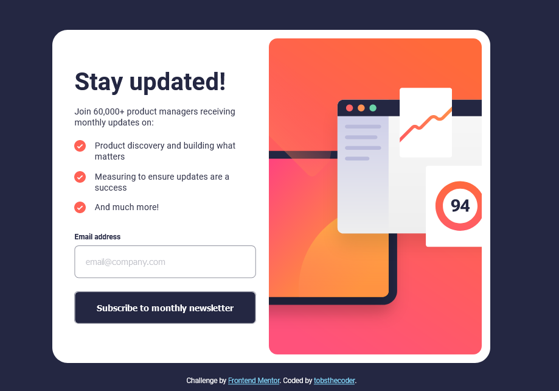

# Frontend Mentor - Newsletter sign-up form with success message solution

This is a solution to the [Newsletter sign-up form with success message challenge on Frontend Mentor](https://www.frontendmentor.io/challenges/newsletter-signup-form-with-success-message-3FC1AZbNrv).

### Screenshot of project

### Links

- Live Site URL: [Add live site URL here](https://devtobs.github.io/Newsletter-Sign-up-form/)

### Built with

- Semantic HTML5 markup
- CSS custom properties
- Flexbox
- Mobile-first workflow

## Author

- Github - [@devtobs](https://github.com/devtobs)
- Frontend Mentor - [@devtobs](https://www.frontendmentor.io/profile/@devtobs)
- Twitter - [@tobsthecoder](https://www.twitter.com/tobsthecoder)
